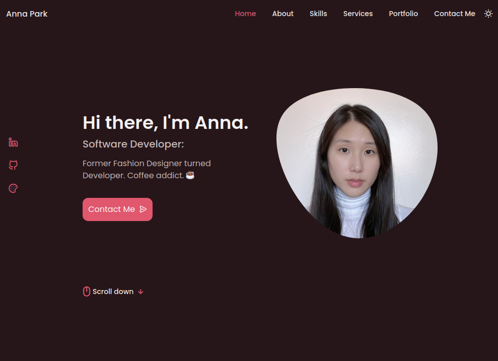
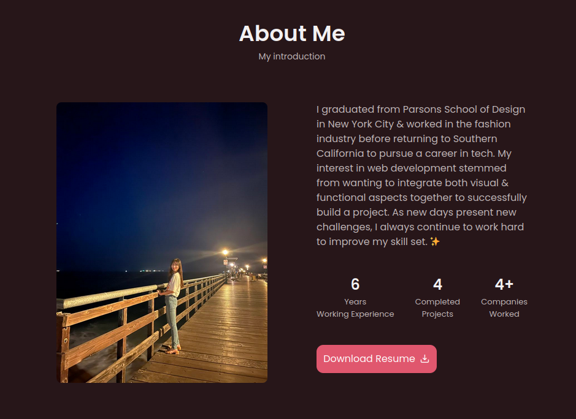
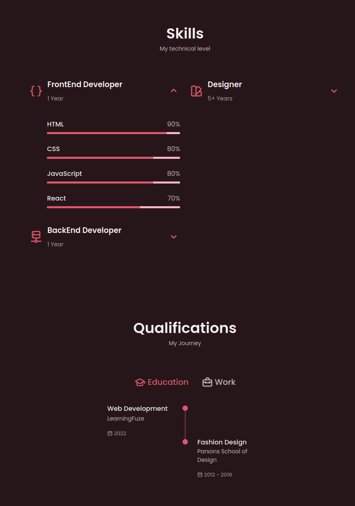
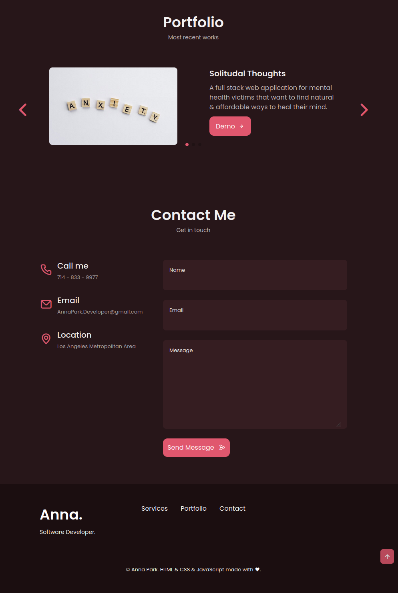

# Personal Portfolio

View my website at [annuhpark.github.io/personal-portfolio/](https://annuhpark.github.io/personal-portfolio/)!

## Sections

Below are the sections that are included in my website:

- About Me
- Skills
- Qualifications
- Services
- Portfolio
- Contact

## Download and Installation

The steps below assume that you are using a terminal and have Node.js installed

1. Clone this repo using your preferred method

2. Change your current working directory into the repository  
   `cd personal-portfolio`

3. Install necessary dependencies
   `npm i`

4. Open `index.html` using your preferred method

## Images

